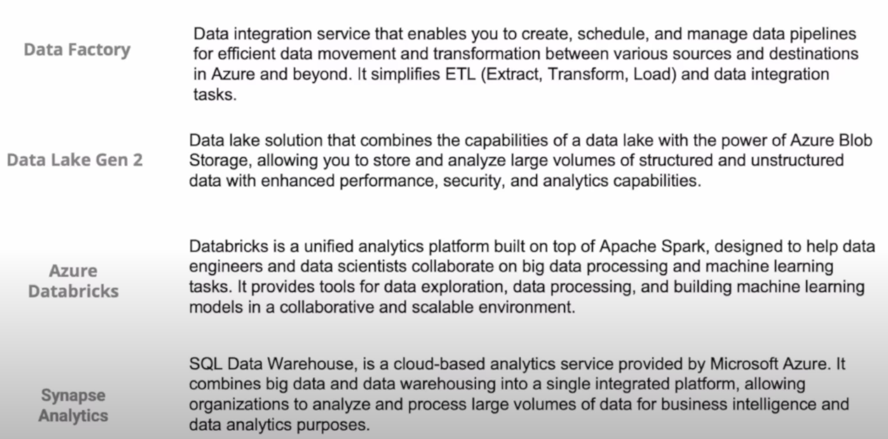
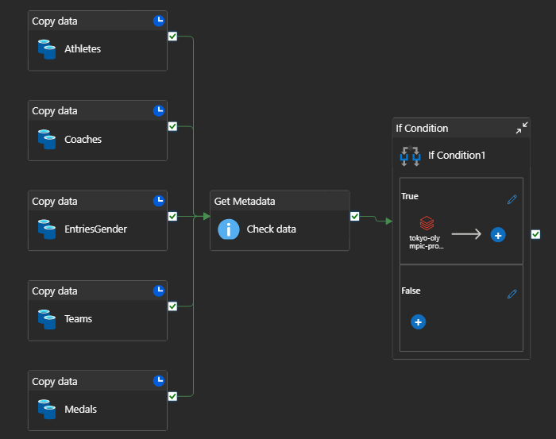
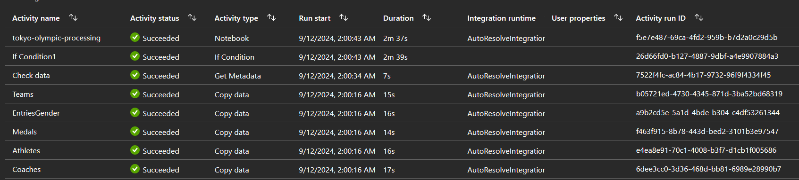
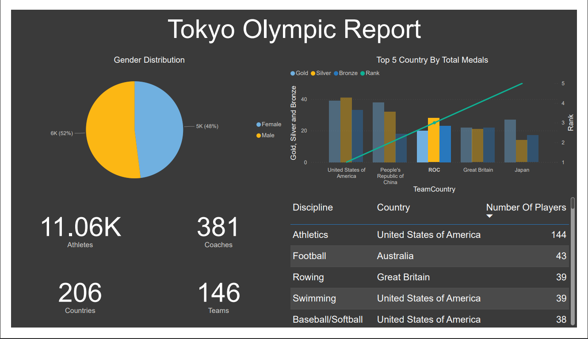

# Olympic Data Analytics Using Azure

## Project FlowChart

## In Project Using These Services

## My Azure Data Factory Pipeline For This Project

## And This Is The Result Of The Pipeline

## This Is The Simple Synap SQL Query And Chart

## The Tokyo Olympic Report

